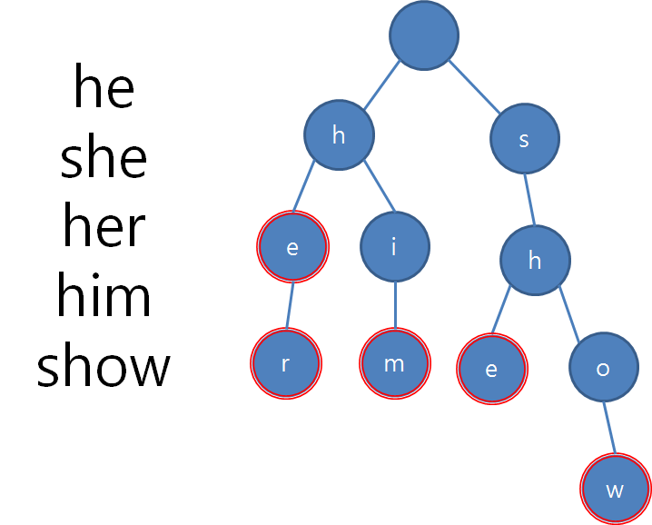

# 336. Palindrome Pairs

**Hard**

Given a list of **unique** words, return all the pairs of the **distinct** indices ```(i, j)``` in the given list, so that the concatenation of the two words ```words[i] + words[j]``` is a palindrome.

단어 리스트에서 ```words[i] + words[j]```가 팰린드롬이 되는 모든 인덱스의 조합 ```(i, j)```를 구하라

**Example 1:**
```
Input: words = ["abcd","dcba","lls","s","sssll"]
Output: [[0,1],[1,0],[3,2],[2,4]]
Explanation: The palindromes are ["dcbaabcd","abcddcba","slls","llssssll"]
```

**Example 2:**
```
Input: words = ["bat","tab","cat"]
Output: [[0,1],[1,0]]
Explanation: The palindromes are ["battab","tabbat"]
```

**Example 3:**
```
Input: words = ["a",""]
Output: [[0,1],[1,0]]
```
 

**Constraints:**

- ```1 <= words.length <= 5000```
- ```0 <= words[i].length <= 300```
- ```words[i] consists of lower-case English letters.```


# 풀이

이 문제를 이해하기 위해서는 먼저 팰린드롬에 대해 알아야 한다. 팰린드롬은 회문이라고 하며, 거꾸로 읽어도 제대로 읽은 것과 같은 문장이나 낱말, 숫자, 문자열 등을 말한다.

"수박이박수", "여보게저기저게보여" 등 슈퍼주니어의 로꾸꺼 라는 노래를 들어본적이 있다면 우리는 팰린드롬을 잘 알고 있는것이다.

사실 이 문제는 브루트포스로 풀이하면 굉장히 쉬운 문제이다. 각각 문자열의 모든 조합을 구성하고 이 조합들이 팰린드롬인지 여부만 확인하면 된다. 다만 O(n^2)의 시간 복잡도를 가지기 때문에 타임아웃이 생긴다. 브루트포스로 시도한 풀이는 wrong.py에서 확인할 수 있다.

O(n)의 시간복잡도로 풀이하기 위해 Trie라는 자료구조를 사용하였다. Trie는 트리의 일종으로 일반적으로 키가 문자열인 동적 배열 또는 연관 배열을 저장하기 위해 사용한다.

트라이의 예시는 다음과 같다.



그럼 어떻게 트라이를 활용해야 이 문제를 풀 수 있을까?
입력값을 뒤집어 트라이를 구성하면 된다

먼저 입력값을 뒤집어 트라이를 구성한다
각 단어가 끝나는 지점에 단어 인덱스를 부여하고 탐색을 진행한다
해당 인덱스까지 탐색을 진행하고 되돌아오며 팰린드롬이 되는 경우 result에 추가한다