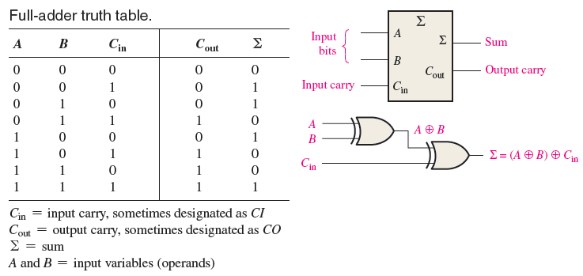

# 371. Sum of Two Integers

**Medium**

Given two integers ```a``` and ```b```, return the sum of the two integers without using the operators ```+``` and ```-```.

두 정수 a와 b의 합을 구하라. + 또는 - 연산자는 사용할 수 없다.

**Example 1:**
```
Input: a = 1, b = 2
Output: 3
```

**Example 2:**
```
Input: a = 2, b = 3
Output: 5
```

**Constraints:**

- ```-1000 <= a, b <= 1000```

# 풀이

당연하게도 비트 연산만으로 풀어야 한다. 이 문제에서는 전가산기를 사용해 풀이하기로 했다



전가산기의 진리표화 회로도이다

2의 보수를 만들기 위해 ```mask = 0xffffffff``` 를 사용했으며 전가산기는 다음과 같이 구현했다
```
a, b = (a ^ b) & mask, ((a & b) << 1) & mask
```
다만 a에는 carry 값을 고려하지 않는 a와 b의 합이 담기게 하고, b에는 자릿수를 올려가며 carry 값이 담기게 했다
